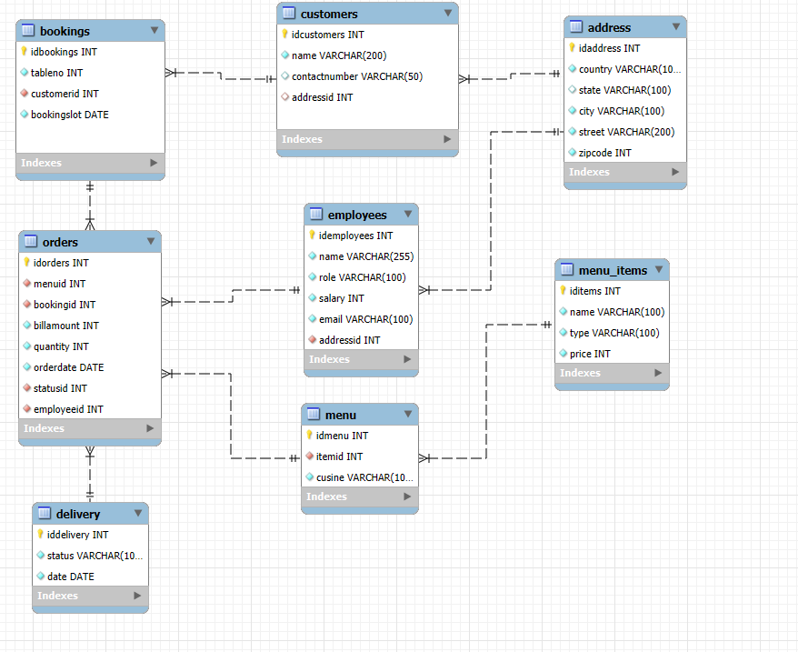
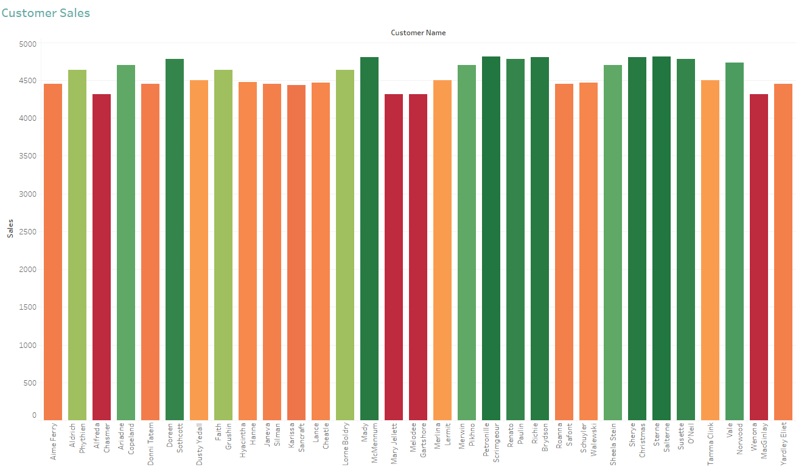
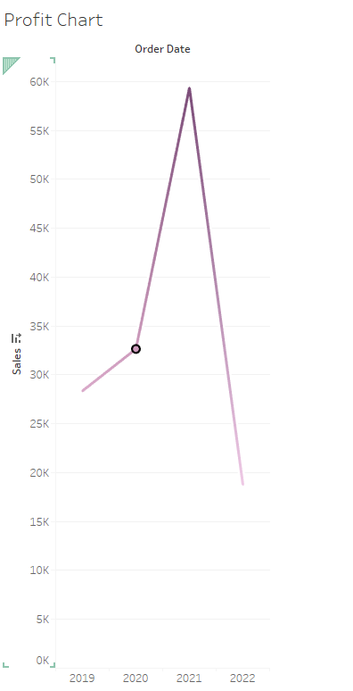
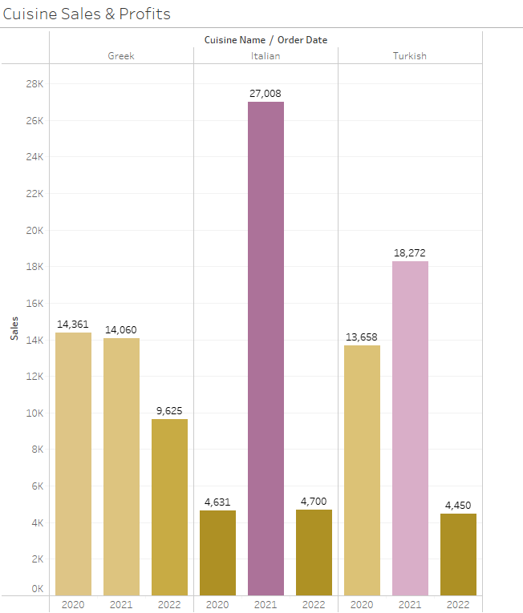
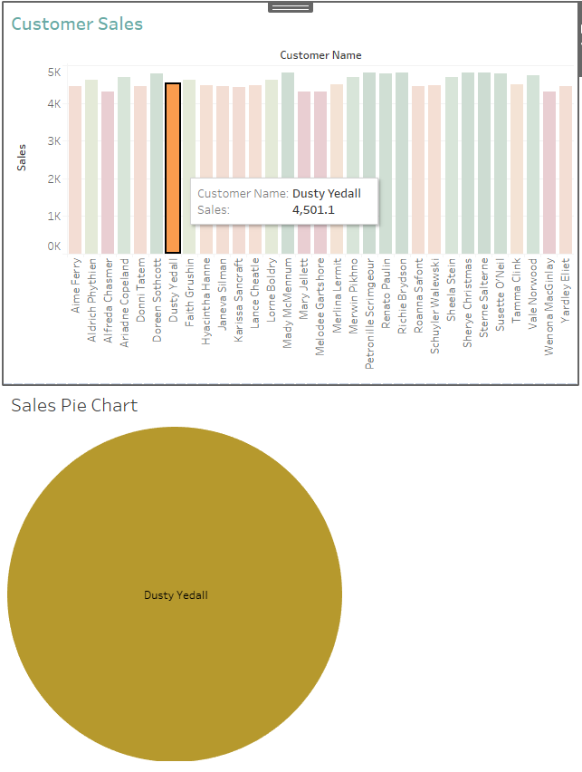

# Little Lemon Restaurant Management System


## Description

The primary goal of this project is to demonstrate my knowledge and understanding of the key learning objectives of the **Meta Database Engineer** professional certificate. The project leverages MySQL for database modeling, Tableau for data analysis, Python as a general scripting language, and GitHub as a repository. 

## Entity-Relationship Diagram




## Installation Script

To set up the database, follow these steps:

1. **Install MySQL**: Download and install MySQL on your computer, including MySQL Workbench for administration purpose. Intructions here: https://dev.mysql.com/downloads/

2. **Import data using SQL script**: You will find in this repository the file [LittleLemonDB.sql](./LittleLemonDB.sql). it contains all the info you need for setting up the database.

3. **Import database objects and testing data in MySQL Workbench**:
    - Open MySQL Workbench.
    - Navigate to `Server` > `Data Import`.
    - Choose `Import from Self-Contained File` and load the `LittleLemonDB.sql` file.
    - Click `Start Import` to both import and execute the SQL commands from the file.

Your database should now be set up and populated with tables,views, stored procedures and other database objects.

## Listing Stored Procedures

### GetMaxQuantity()
This stored procedure retrieves the maximum quantity of a specific item that has been ordered.

DELIMITER //

CREATE PROCEDURE GetMaxQuantity(OUT max_quantity INT)
BEGIN
    SELECT MAX(Quantity) INTO max_quantity
    FROM littlelemondb.Orders;
END //

DELIMITER ;

### CheckBooking()

The CheckBooking stored procedure validates if a table/date is available or already booked.

DELIMITER $$

CREATE PROCEDURE CheckBooking(IN booking_date DATE, IN table_number INT)
BEGIN
    DECLARE booking_status INT;

    -- Check if the table is booked
    SELECT COUNT(*) INTO booking_status
    FROM Bookings
    WHERE bookingslot = booking_date 
    AND tableno = table_number;

    -- Return the booking status
    IF booking_status = 0 THEN
        SELECT concat('The table ', table_number,' is available for this date.') Booking_status;
    ELSE
        SELECT concat('The table ', table_number,' is already booked for this date.') Booking_status;
    END IF;
END$$

DELIMITER ;

### UpdateBooking()
This stored procedure updates the booking date for a specific booking id.
``` sql
DELIMITER //

CREATE PROCEDURE UpdateBooking  (IN booking_id INT,IN booking_date DATE)
BEGIN

	UPDATE Bookings
    SET bookingslot = booking_date
    WHERE idbookings = booking_id;
    COMMIT;
    SELECT concat('Booking ', booking_id,' has been updated.') as "Booking status";

END //

DELIMITER ;
```

### AddBooking() 
This procedure adds a new booking to the database using the required columns to do so.

``` sql
DELIMITER //

CREATE PROCEDURE AddBooking (IN booking_id INT,IN customer_id INT,  IN table_number INT,IN booking_date DATE)
BEGIN

	INSERT INTO bookings (idbookings,customerid, tableno, bookingslot)
    VALUES (booking_id, customer_id, table_number,booking_date);
    COMMIT;
    SELECT 'New booking successfully added' as "Booking status";

END //

DELIMITER ;
```

### CancelOrder()
This stored procedure deletes a specific order from the database.

``` sql
DELIMITER $$
#
CREATE PROCEDURE CancelOrder(IN order_id INT)
BEGIN
    DECLARE order_exists INT;
    
    -- Check if the order exists
    SELECT COUNT(*) INTO order_exists
    FROM Orders
    WHERE idorders = order_id;

    IF order_exists = 0 THEN
        SELECT CONCAT('No order found with OrderID = ', order_id) AS Message;
    ELSE
        -- Delete the order
        DELETE FROM Orders
        WHERE idorders = order_id;
        
        SELECT CONCAT('Order ', order_id, ' has been canceled.') AS Message;
    END IF;
END$$

DELIMITER ;
```

### AddValidBooking()
This procedure aims to securely add a new table booking record. It starts a transaction and attempts to insert a new booking record, checking the table's availability.

``` sql
DELIMITER //

CREATE PROCEDURE AddValidBooking(IN booking_date DATE,  IN table_number INT)
BEGIN
  DECLARE existing_booking INT;

  START TRANSACTION;

  SELECT COUNT(*) INTO existing_booking
  FROM bookings
  WHERE bookingslot = booking_date 
  AND tableno = table_number;

  IF existing_booking > 0 THEN
    ROLLBACK;
    #SIGNAL SQLSTATE '45000' SET MESSAGE_TEXT = 'Table is already booked on the given date.';
    SELECT 'Table is already booked on the given date. -booking cancelled' booking_status;
  ELSE
    INSERT INTO bookings (bookingslot, tableno)
    VALUES (booking_date, table_number);
    COMMIT;
    SELECT 'New booking successfully added' as "Booking status";
  END IF;
END //

DELIMITER ;
```

## Data Analysis with Tableau
A Tableau workbook has been created, featuring various charts and dashboards to facilitate data analysis. You can download the workbook [here](./Capstone_charts.twb)

### Customers sales bar chart


### Profit Line chart


### Customer Sales Bubble Chart


###  Cuisine Sales and Profits comparison chart


### Interactive Dashboard



